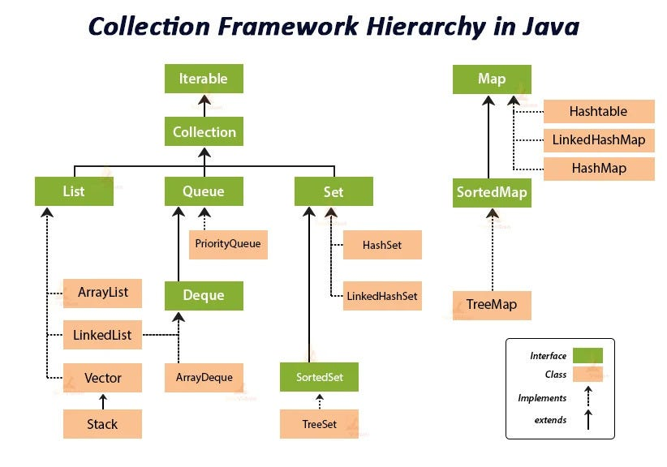
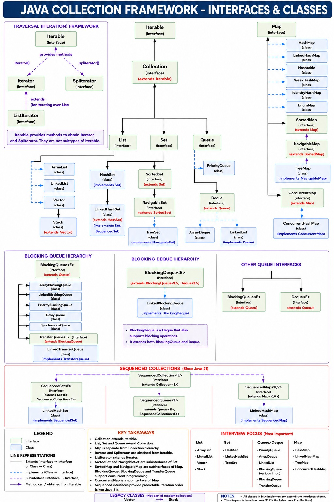

# Java Collection Framework Hierarchy


# Important Collections Hierarchy


# Complete Collections Hierarchy



```text
Iterable (Interface)
│
└── Collection (Interface)
    │
    ├── List (Interface)
    │   ├── ArrayList (Class)
    │   ├── LinkedList (Class)
    │   ├── Vector (Class)
    │   └── Stack (Class)
    │
    ├── Set (Interface)
    │   ├── HashSet (Class)
    │   ├── LinkedHashSet (Class)
    │   └── TreeSet (Class)
    │
    └── Queue (Interface)
        ├── PriorityQueue (Class)
        ├── ArrayDeque (Class)
        └── LinkedList (Class)

Map (Interface)   ← Separate from Collection
│
├── HashMap (Class)
├── LinkedHashMap (Class)
├── TreeMap (Class)
└── Hashtable (Class)
```

## Notes

* `Iterable` is the root interface that allows objects to be traversed using loops.
* `Collection` is the main interface for storing groups of objects.
* `List`, `Set`, and `Queue` extend the `Collection` interface.
* `Map` is part of the Collection Framework but does **not** extend the `Collection` interface.
* `ArrayList`, `HashSet`, `HashMap`, etc. are concrete classes used to create objects.

### Examples

```java
List<String> list = new ArrayList<>();

Set<Integer> set = new HashSet<>();

Queue<String> queue = new LinkedList<>();

Map<Integer, String> map = new HashMap<>();
```