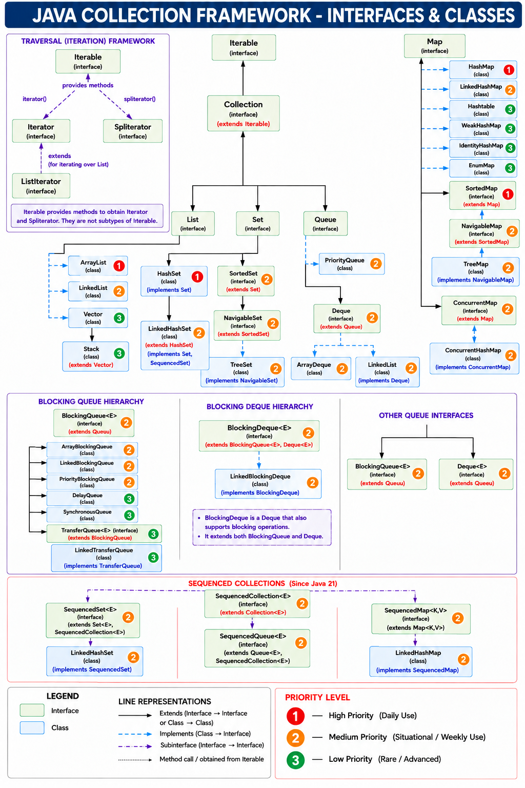

# Java Collection Framework

## What is a Collection?

In Java, **`Collection` is an interface that represents a group of objects and provides common operations to work with those objects.**

For example:

```java
Collection<String> fruits = new ArrayList<>();

fruits.add("Apple");
fruits.add("Banana");
fruits.add("Mango");
```

Here:

```text
Collection<String> 
    represents
        ↓
Group of String objects
        ↓
    "Apple"
    "Banana"
    "Mango"
```

We can use common collection operations such as:

```java
fruits.add("Orange");
fruits.remove("Banana");
fruits.contains("Mango");
fruits.size();
```

### What is an Object?

An **object** is an instance of a class.

For example:

```java
String name = "Asif";
```

`String` is a class, and `"Asif"` is a `String` object.

Similarly:

```java
Collection<Student> students = new ArrayList<>();
```

means the collection can hold multiple `Student` objects.

> **Key Point:** `Collection` is a Java interface used to represent and work with a group of objects. Concrete Classes such as `ArrayList`, `HashSet`, and `LinkedList` provide the actual implementations.

---

# What is the Java Collection Framework?

The **Java Collection Framework (JCF)** is a set of **interfaces, classes, and utilities** that provides ready-made data structures and operations for storing and working with groups of objects.

It provides different collection types for different requirements.

For example:

```text
List
Set
Queue
Deque
```

Each type is designed for a different way of organizing data.

---

# Generics in Collections

**Generics** specify the type of objects that a collection is intended to store.

They provide **compile-time type safety**, preventing invalid types from being added.

```java
List<String> names = new ArrayList<>();

names.add("John");     // ✅ Allowed
names.add("Asif");     // ✅ Allowed
// names.add(10);      // ❌ Compile-time Error
```

Here:

```text
List<String>
    ↓
Collection is intended to store String objects
```

Other examples:

```java
List<String> names;
List<Integer> numbers;
List<Double> marks;
```

### Without Generics

A collection can be declared as a **Raw Type**:

```java
List names = new ArrayList<>();

names.add("John");
names.add(10);
names.add(true);
```

Different object types can be stored, but type safety is reduced.

For example:

```java
String name = (String) names.get(1);
```

The actual object is an `Integer`, not a `String`, so the error occurs **at runtime**:

```text
ClassCastException
```

With Generics, the invalid type is caught **at compile time**:

```java
List<String> names = new ArrayList<>();

// names.add(10);   // ❌ Compile-time Error
```

> **Key Point:** Generics provide compile-time type safety, preventing many type-related errors that could otherwise occur at runtime.

---

# What About Primitive Types?

Collections do not use primitive types directly.

For example:

```java
ArrayList<int> numbers = new ArrayList<>();   // ❌
```

Instead, we use the corresponding **wrapper class**:

```java
ArrayList<Integer> numbers = new ArrayList<>();

numbers.add(10);
numbers.add(20);
```

Here:

```text
int      → Integer
double   → Double
char     → Character
boolean  → Boolean
```

Java automatically converts the primitive value into its wrapper object when needed. This is called **Autoboxing**.

In:

```java
numbers.add(10);
```

the `10` you write is an **`int` primitive value**.

Because:

```java
ArrayList<Integer> numbers
```

expects an `Integer` object, Java automatically converts the `int` `10` into an `Integer` object.

```text
10 (int primitive)
      ↓
Autoboxing
      ↓
Integer object
```

So you can think of it as:

```java
numbers.add(Integer.valueOf(10));
```

---

# Why Do We Need Collections?

Java already provides **arrays** for storing multiple values.

However, arrays have a **fixed size** and provide only basic support for managing their elements.

Collections provide ready-made data structures and operations that make working with groups of data more flexible.

Common operations include:

```text
Add
Remove
Search
Traverse
Store
Organize
```

This is especially useful when the amount of data or the way it needs to be managed can change.

---

# Array vs Collection

| Feature             | Array                                  | Collection                              |
| ------------------- | -------------------------------------- | --------------------------------------- |
| Size                | Fixed                                  | Most implementations can grow or shrink |
| Stores              | Primitive values and object references | Objects                                 |
| Built-in operations | Limited                                | Many ready-made operations              |
| Data structures     | Array                                  | List, Set, Queue, Deque, etc.           |
| Flexibility         | Lower                                  | Higher                                  |

> **Key Point:** An array is a built-in Java language feature, while Collection are provided by the Java Collection Framework.

---

#  Collection vs Collections

| `Collection`                                                 | `Collections`                                            |
| ------------------------------------------------------------ |----------------------------------------------------------|
| **Interface**                                                | **Utility class**                                        |
| Represents a **group of objects**                            | Provides **utility operations** on collections(List, Set, etc)         |
| Defines common operations like `add()`, `remove()`, `size()` | Provides methods like `sort()`, `reverse()`, `shuffle()` |
| Part of the **collection hierarchy**                         | Not part of the collection hierarchy                     |
| Parent of `List`, `Set`, and `Queue`                         | Contains **static methods**                              |
| Example: `Collection<String> c`                              | Example: `Collections.sort(list)`                        |

---

# Java Collection Framework Hierarchy


> **Note:** Java 21 introduced `SequencedCollection`, but there is **no `SequencedList` interface**. `List` extends `SequencedCollection` directly because Lists were already ordered collections. `SequencedSet` and `SequencedMap` were introduced to provide sequencing for Sets and Maps.

---

# Java Collection Framework - Declarations (Who Extends & Who Implements)

---

# Iterable Hierarchy

```java
public interface Iterable<T> {
    Iterator<T> iterator();
    Spliterator<T> spliterator();
}
```

```java
public interface Iterator<E> {
}
```

```java
public interface ListIterator<E> extends Iterator<E> {
}
```

```java
public interface Spliterator<T> {
}
```

---

# Collection Hierarchy

```java
public interface Collection<E> extends Iterable<E> {
}
```

---

# List Hierarchy

```java
Older Documentation
public interface List<E> extends Collection<E> {
}

After Java 21+
public interface List<E> extends SequencedCollection<E> {
}
```

```java
public class ArrayList<E>
        extends AbstractList<E>
        implements List<E>, RandomAccess, Cloneable, Serializable

public abstract class AbstractList<E>
        extends AbstractCollection<E>
        implements List<E>

public abstract class AbstractCollection<E>
        implements Collection<E>
```
Marker Interfaces - RandomAccess, Cloneable, Serializable  (see Marker-Interfaces.md)

```java
public class LinkedList<E>
        extends AbstractSequentialList<E>
        implements List<E>, Deque<E>,
        Cloneable, Serializable

public abstract class AbstractSequentialList<E>
        extends AbstractList<E>

public abstract class AbstractList<E>
        extends AbstractCollection<E>
        implements List<E>

public abstract class AbstractCollection<E>
        implements Collection<E>
```

```java
public class Vector<E>
        implements List<E>, RandomAccess, Cloneable, Serializable {
}
```

```java
public class Stack<E>
        extends Vector<E> {
}
```

---

# Set Hierarchy

```java
public interface Set<E> extends Collection<E> {
}
```
```java
NOTE : 
List
→ Ordered collection
→ Java 21: extends SequencedCollection for common first/last/reversed operations.

Set
→ Unique elements
→ Order is not required
→ Therefore extends Collection.

SequencedSet
→ Adds sequencing operations like getFirst(), getLast(), addFirst(), addLast(), reversed().

HashSet
→ Unique + no guaranteed order.

LinkedHashSet
→ Unique + insertion order
→ Hence Implements SequencedSet to get those methods 
```

```java
public interface SortedSet<E>
        extends Set<E> {
}
```

```java
public interface NavigableSet<E>
        extends SortedSet<E> {
}
```

```java
public class HashSet<E>
        extends AbstractSet<E>
        implements Set<E>, Cloneable, Serializable

public abstract class AbstractSet<E>
        extends AbstractCollection<E>
        implements Set<E>

public abstract class AbstractCollection<E>
        implements Collection<E>
```

```java
public class LinkedHashSet<E>
        extends HashSet<E>
        implements SequencedSet<E>, Cloneable, Serializable
```

```java
public class TreeSet<E>
        extends AbstractSet<E>
        implements NavigableSet<E>, Cloneable, Serializable
```

---

# Queue Hierarchy

```java
public interface Queue<E>
        extends Collection<E> {
}
```

```java
public interface Deque<E>
        extends Queue<E> {
}
```

```java
public class PriorityQueue<E>
        implements Queue<E>, Serializable {
}
```

```java
public class ArrayDeque<E>
        implements Deque<E>, Cloneable, Serializable {
}
```

> **Note:** `LinkedList` also implements `Deque`, so it belongs to both the **List** and **Queue** hierarchies.

---

# Blocking Queue Hierarchy

```java
public interface BlockingQueue<E>
        extends Queue<E> {
}
```

```java
public interface TransferQueue<E>
        extends BlockingQueue<E> {
}
```

```java
public interface BlockingDeque<E>
        extends BlockingQueue<E>, Deque<E> {
}
```

---

## BlockingQueue Implementations

```java
public class ArrayBlockingQueue<E>
        implements BlockingQueue<E>, Serializable {
}
```

```java
public class LinkedBlockingQueue<E>
        implements BlockingQueue<E>, Serializable {
}
```

```java
public class PriorityBlockingQueue<E>
        implements BlockingQueue<E>, Serializable {
}
```

```java
public class DelayQueue<E>
        implements BlockingQueue<E> {
}
```

```java
public class SynchronousQueue<E>
        implements BlockingQueue<E>, Serializable {
}
```

```java
public class LinkedTransferQueue<E>
        implements TransferQueue<E>, Serializable {
}
```

---

## BlockingDeque Implementation

```java
public class LinkedBlockingDeque<E>
        implements BlockingDeque<E>, Serializable {
}
```

---

# Map Hierarchy

```java
public interface Map<K, V> {
}
```

```java
public interface SortedMap<K, V>
        extends Map<K, V> {
}
```

```java
public interface NavigableMap<K, V>
        extends SortedMap<K, V> {
}
```

```java
public interface ConcurrentMap<K, V>
        extends Map<K, V> {
}
```

---

## Map Implementations

```java
public class HashMap<K, V>
        implements Map<K, V>, Cloneable, Serializable {
}
```

```java
public class LinkedHashMap<K, V>
        extends HashMap<K, V>
        implements SequencedMap<K, V> {
}
```

```java
public class Hashtable<K, V>
        implements Map<K, V>, Cloneable, Serializable {
}
```

```java
public class WeakHashMap<K, V>
        implements Map<K, V> {
}
```

```java
public class IdentityHashMap<K, V>
        implements Map<K, V>, Serializable, Cloneable {
}
```

```java
public class EnumMap<K extends Enum<K>, V>
        implements Map<K, V>, Cloneable, Serializable {
}
```

```java
public class TreeMap<K, V>
        implements NavigableMap<K, V>, Cloneable, Serializable {
}
```

```java
public class ConcurrentHashMap<K, V>
        implements ConcurrentMap<K, V>, Serializable {
}
```

---

# Java 21 Sequenced Collections

```java
public interface SequencedCollection<E>
        extends Collection<E> {
}
```

```java
public interface SequencedSet<E>
        extends Set<E>, SequencedCollection<E> {
}
```

```java
public interface SequencedQueue<E>
        extends Queue<E>, SequencedCollection<E> {
}
```

```java
public interface SequencedMap<K, V>
        extends Map<K, V> {
}
```

---
# Tight Coupling vs Loose Coupling

## Tight Coupling

```java
ArrayList<Integer> nums = new ArrayList<>();
```

The reference type is the specific implementation:

```text
ArrayList
```

So the code is directly coupled to `ArrayList`.

Changing the implementation requires changing the reference type:

```java
LinkedList<Integer> nums = new LinkedList<>();
```

---

## Loose Coupling

```java
List<Integer> nums = new ArrayList<>();
```

The reference type is an interface:

```text
List
```

Because the code depends on the interface, the implementation can be changed easily:

```java
List<Integer> nums = new LinkedList<>();
```

The reference type remains:

```text
List<Integer>
```

---

## Can We Create an Object of an Interface?

No, an interface **cannot be instantiated directly**.

```java
Collection<Integer> nums = new Collection<>(); // ❌ Not Allowed
```

The problem is:

```java
new Collection<>()
```

`new` is used to **create an object**, but `Collection` is an **interface**.

Therefore, Java requires us to create the object using a **concrete implementation class** of that interface.

```java
Collection<Integer> nums = new ArrayList<>();  // ✅
Collection<Integer> nums = new LinkedList<>(); // ✅
Collection<Integer> nums = new HashSet<>();    // ✅
```

Here:

```text
Collection<Integer> → Reference Type
ArrayList<Integer>  → Actual Object
```

### Rule

> **You cannot create an object directly from an interface, but you can use an interface as the reference type for an object of a class that implements it.**

---

# Which Reference Types Can Be Used?

The reference type must be a type that the concrete class **implements or extends**.

### ArrayList

```java
Collection<Integer> c = new ArrayList<>();
List<Integer>       l = new ArrayList<>();
Iterable<Integer>   i = new ArrayList<>();
```

### LinkedList

```java
Collection<Integer> c = new LinkedList<>();
List<Integer>       l = new LinkedList<>();
Queue<Integer>      q = new LinkedList<>();
Deque<Integer>      d = new LinkedList<>();
Iterable<Integer>   i = new LinkedList<>();
```

### HashSet

```java
Collection<Integer> c = new HashSet<>();
Set<Integer>        s = new HashSet<>();
Iterable<Integer>   i = new HashSet<>();
```

### Important Rule

> **Reference Type must be a superclass or interface that the actual class is compatible with.**

Example:

```java
List<Integer> nums = new ArrayList<>();  // ✅
Set<Integer> nums = new HashSet<>();     // ✅

Queue<Integer> nums = new HashSet<>();   // ❌
```

`HashSet` does not implement `Queue`.

---

# Choosing the Right Collection

The basic choice depends on **how you want to organize and access the data**.

| Requirement                                      | Use       |
| ------------------------------------------------ | --------- |
| Need ordered elements and duplicates are allowed | **List**  |
| Need unique elements                             | **Set**   |
| Need elements to wait for processing             | **Queue** |
| Need key-value lookup                            | **Map**   |

### Examples

| Problem                       | Suitable Collection | Reason                                           |
| ----------------------------- | ------------------- | ------------------------------------------------ |
| Songs in a playlist           | List                | Order can be maintained and duplicates can exist |
| Unique email IDs              | Set                 | Duplicate values are not allowed                 |
| Customers waiting for service | Queue               | Elements wait to be processed                    |
| Employee ID → Employee        | Map                 | Data can be accessed using a key                 |